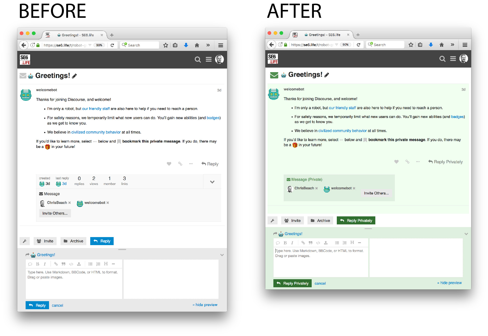
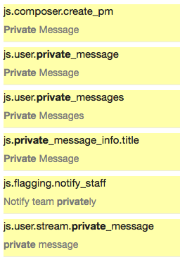

# discourse-private-message-clarity

Theme for [Discourse](https://meta.discourse.org) forums, making it clearer when a user 
is private messaging 

* Adds "Privately" and "(Private)" to some UI elements
* Adopts a subtle green theme in private message screens
* Hides extraneous topic metadata from private message UI
* Enlarges the envelope UI detail in the header

### Installation

1. Admin > Customize > Themes > Import > From the web
2. Type: https://github.com/chrisbeach/discourse-private-message-clarity
4. Select your current theme (it's indicated with a star)
5. Under "Theme Components," select "Private Message Clarity" and click "Add"

### Recommended Text Customisation

Use **Admin > Customise > Text Content** to set the following:

### In use at:

* [SE23.life](https://se23.life)
* [SE26.life](https://se26.life)

### License

Apache 2.0

